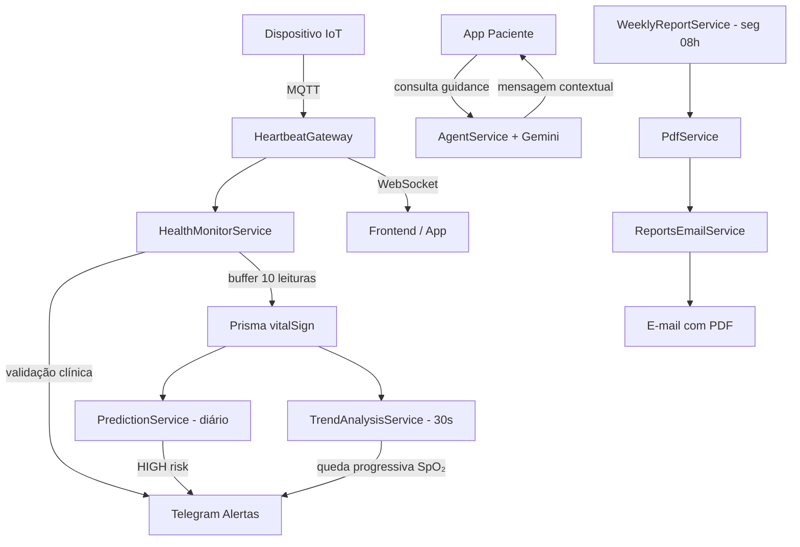

# VitalMonitor – Sistema de Monitoramento Assistivo de Sinais Vitais

Sistema completo de monitoramento em tempo real voltado para idosos, pacientes crônicos e empresas de saúde/cuidado assistivo. Coleta dados de frequência cardíaca (BPM), saturação de oxigênio (SpO₂) e detecção de quedas via dispositivos IoT → valida limites clínicos personalizados → envia alertas instantâneos → realiza análise preditiva → gera relatórios semanais automatizados.

**Status do projeto:** MVP funcional com backend robusto e múltiplas camadas de inteligência e automação.

---

## ✨ Funcionalidades Principais

* Recebimento de dados em tempo real via **MQTT** (batimentos + quedas)
* Validação clínica contextualizada por atividade (repouso, caminhada, sono)
* Alertas instantâneos via **Telegram** (taquicardia, bradicardia, hipóxia, queda, tendência de queda de SpO₂)
* Buffer inteligente (médias a cada ~10 leituras) → menor carga no banco
* Análise preditiva diária de risco (baseline pessoal + episódios de hipóxia)
* **Orientação em tempo real ao paciente** via Google Gemini 1.5 Flash
* Dashboard empresarial com visão agregada e status individual de pacientes
* Autenticação JWT unificada (staff + pacientes no mesmo fluxo)
* Geração e envio automático de **relatórios semanais em PDF por e-mail**
* Análise contínua de tendências de SpO₂ (detecção precoce de deterioração)

---

## 🧱 Stack Tecnológico (2026)

| Camada           | Tecnologia                                         | Finalidade                        |
| ---------------- | -------------------------------------------------- | --------------------------------- |
| Framework        | NestJS                                             | Estrutura modular, DI             |
| Banco de Dados   | PostgreSQL + Prisma ORM                            | Modelos relacionais complexos     |
| IoT / Tempo real | MQTT (EMQX) + Socket.IO                            | Dispositivos → backend → frontend |
| Autenticação     | JWT + Passport                                     | Login unificado                   |
| Notificações     | Telegraf (Telegram)                                | Alertas críticos                  |
| IA / Guidance    | Google Gemini 1.5 Flash                            | Orientação contextual             |
| Relatórios       | pdfkit + Nodemailer                                | PDFs semanais + e-mail            |
| Agendamento      | @nestjs/schedule                                   | Predições diárias e relatórios    |
| Segurança        | bcrypt (pacientes) / texto puro (staff temporário) | Hash seletivo                     |

---

## 🗂️ Estrutura de Módulos

```text
src/
├── auth/
│   ├── auth.service.ts
│   ├── jwt.strategy.ts
│   └── jwt-auth.guard.ts
├── heartbeat/
│   └── heartbeat.gateway.ts
├── health-monitor/
│   └── health-monitor.service.ts
├── dashboard/
│   └── dashboard.service.ts
├── patients/
│   └── patients.service.ts
├── prediction/
│   ├── prediction.service.ts
│   └── prediction.scheduler.ts
├── agent/
│   └── agent.service.ts
├── telegram/
│   └── telegram.service.ts
├── pdf/
│   └── pdf.service.ts
├── reports-email/
│   └── reports-email.service.ts
├── weekly-report/
│   └── weekly-report.service.ts
├── trend-analysis/
│   └── trend-analysis.service.ts
└── prisma/
    └── schema.prisma
```

---

## 🔄 Fluxo Completo de Dados



---

## 🚀 Principais Diferenciais

* **Thresholds por atividade** (repouso, caminhada, sono)
* **Buffer otimizado** (menos writes no banco)
* **Autenticação unificada** (staff + pacientes)
* **Guidance com IA em tempo real** baseado no histórico individual
* **Detecção precoce de tendência negativa de SpO₂**
* **Relatórios semanais automatizados** em PDF

---

## ▶️ Como Rodar

### Variáveis de Ambiente (.env)

```env
DATABASE_URL="postgresql://..."
JWT_SECRET="super-long-random-string-2026"

TELEGRAM_BOT_TOKEN=xxxx
TELEGRAM_CHAT_ID_PADRAO=xxxx

GEMINI_API_KEY=xxxx

SMTP_HOST=smtp.gmail.com
SMTP_PORT=587
SMTP_USER=seu-email@gmail.com
SMTP_PASS=app-password
MAIL_FROM="HealthMonitor <seu-email@gmail.com>"
```

### Comandos

```bash
# Instalar dependências
npm install

# Prisma
npx prisma generate
npx prisma db push   # ou prisma migrate dev

# Desenvolvimento
npm run start:dev

# Produção
npm run build
npm run start:prod
```

---

## 🗺️ Roadmap (2026)

* Autenticação com refresh token + logout
* Rate limiting (MQTT, WS e API)
* Cache distribuído (Redis) para dashboard
* Suporte multilíngue (pt-BR / en)
* Push notifications mobile (FCM)
* Exportação de dados pelo paciente (CSV/PDF)
* Testes E2E (MQTT mock + Jest)
* Docker + docker-compose oficial

---

## 📄 Licença

MIT

---

**VitalMonitor**
Tecnologia assistiva com foco em prevenção e tranquilidade
Fortaleza, Brasil — 2026
